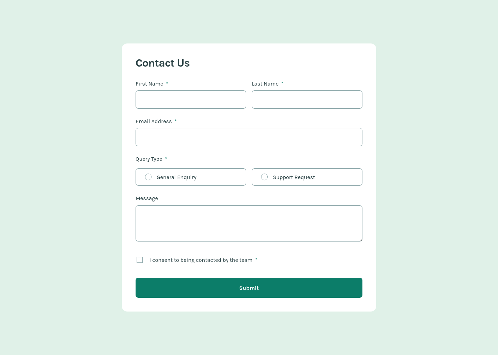

# Frontend Mentor - Contact form solution

This is a solution to the [Contact form challenge on Frontend Mentor](https://www.frontendmentor.io/challenges/contact-form--G-hYlqKJj). Frontend Mentor challenges help you improve your coding skills by building realistic projects.

## Table of contents

- [Overview](#overview)
  - [The challenge](#the-challenge)
  - [Screenshot](#screenshot)
  - [Links](#links)
- [My process](#my-process)
  - [Built with](#built-with)
  - [What I learned](#what-i-learned)
  - [Useful resources](#useful-resources)
- [Author](#author)

## Overview

### The challenge

Users should be able to:

- [x] Complete the form and see a success toast message upon successful submission
- [x] Receive form validation messages if:
  - [x] A required field has been missed
  - [x] The email address is not formatted correctly
- [x] Complete the form only using their keyboard
- [x] Have inputs, error messages, and the success message announced on their screen reader
- [x] View the optimal layout for the interface depending on their device's screen size
- [x] See hover and focus states for all interactive elements on the page

### Screenshot

### Links

- Solution URL: [Add solution URL here](https://your-solution-url.com)
- Live Site URL: [Add live site URL here](https://your-live-site-url.com)

## My process

### Built with

- Semantic HTML5 markup with `aria-live`, `aria-required`, and `aria-invalid` attributes
- CSS custom properties for design tokens (see [base.css](https://github.com/joshjavier/contact-form/blob/main/src/assets/css/base.css))
- CSS layers with `@layer` (see [main.css](https://github.com/joshjavier/contact-form/blob/main/src/assets/css/main.css))
- [A (more) modern CSS reset](https://piccalil.li/blog/a-more-modern-css-reset/)
- [11ty](https://www.11ty.dev/) - simpler static site generator
- [Valibot](https://valibot.dev/) - open source schema library for form validation

### What I learned

- `display: flex` doesn't work on `<fieldset>`. I tried on Google Chrome and Floorp (a fork of Firefox) and I just couldn't get it to work. Apparently the `<legend>` and `<fieldset>` elements is a [common frustration among devs](https://adrianroselli.com/2022/07/use-legend-and-fieldset.html). To apply spacing, I used a `.flow` utility class instead.

- CSS `color-mix()` is pretty awesome. Personally, it makes it easy to translate a design I see on Figma into code. Like, this button has a hover style that applies 50% black overlay? Okay, let's mix the primary color with 50% black. No more fumbling to get a new hex code for each state. That said, it's a new-ish CSS feature so I need to use a CSS bundler with transpilation features (like Lightning CSS) but I can see myself using this a lot more in future projects.

### Useful resources

- [A Guide To Accessible Form Validation](https://www.smashingmagazine.com/2023/02/guide-accessible-form-validation/) - This is my main reference for implementing the validation logic.
- [A Complete Guide To Live Validation UX](https://www.smashingmagazine.com/2022/09/inline-validation-web-forms-ux/) - Another brilliant article focusing on live validation dos and don'ts.
- [Top 10 JavaScript Data Validation Libraries](https://byby.dev/js-object-validators) - This is where I discovered Valibot while scouring for the best validation library to use.
- [A guide to designing accessible, WCAG-conformant focus indicators](https://www.sarasoueidan.com/blog/focus-indicators/) - Thanks to Sara for releasing this modified excerpt from her paid video course. This is where I got about the "Oreo-focus" indicators which I used for this challenge.
- [CSS color-mix()](https://developer.chrome.com/docs/css-ui/css-color-mix)
- [CSS and JavaScript as first-class citizens in Eleventy](https://pepelsbey.dev/articles/eleventy-css-js/) - This inspired me to take a "first principles" approach for this challenge. I didn't use a bundler, but instead relied on the native import features of CSS and JS (ESM modules) that work in the browser.

## Author

<!-- - Website - [Josh Javier](https://joshjavier.com/) -->
- Frontend Mentor - [@joshjavier](https://www.frontendmentor.io/profile/joshjavier)
- Twitter - [@joshjavierr](https://www.twitter.com/joshjavierr)
